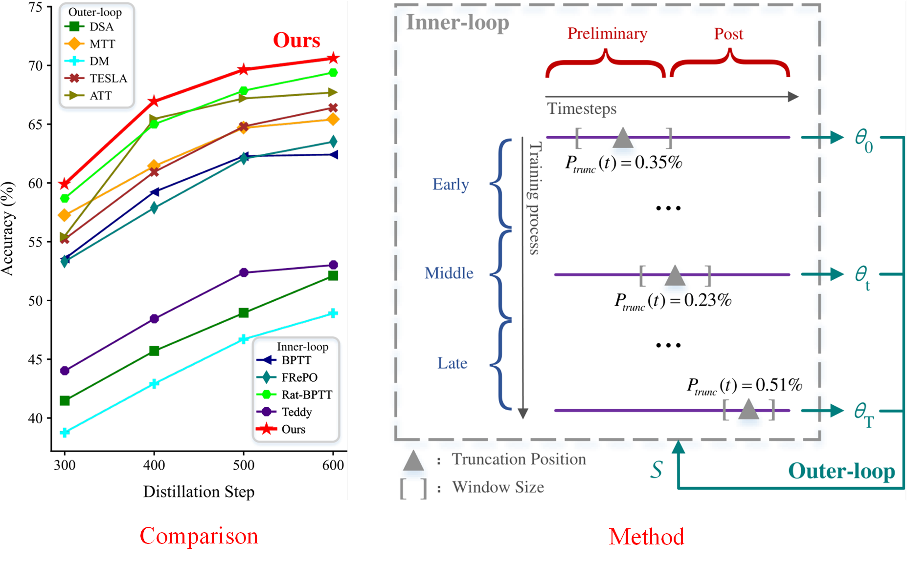

## [When Random Is Not Enough: Exploring Automatic Truncated Optimization for Dataset Distillation](https://github.com/GH209515338/AT-BPTT/blob/main/README.md)

---

#### [Project Page]() | [Paper]()

---
### Abstract

The growing demand for efficient deep learning has positioned dataset distillation as a pivotal technique for compressing training dataset while preserving model performance. However, existing inner-loop optimization methods in bilevel dataset distillation suffer from suboptimal gradient dynamics due to uniform truncation strategies across training stages. This paper identifies that neural networks exhibit distinct learning patterns during early, middle, and late training stages, rendering rigid truncation approaches ineffective. To address this challenge, we propose the Automatic Truncated Backpropagation Through Time (AT-BPTT), a novel framework that flexibly adapts truncation positions and window sizes to align with intrinsic gradient dynamics. AT-BPTT integrates three key innovations: a probabilistic truncation mechanism for stage-aware timestep selection, an adaptive window sizing strategy driven by gradient variation analysis, and a threshold-guided transition protocol for stable stage switching. Extensive experiments on CIFAR-10, CIFAR-100, Tiny-ImageNet, and ImageNet-1 K demonstrate that AT-BPTT achieves state-of-the-art performance, outperforming the baseline method by an average of 2.4% in accuracy.

### Introduction

Our contributions are summarized as follows:

- We establishes an intrinsic connection between the gradient dynamics governing DNN training process and the BPTT framework, thereby highlighting the critical need for automatic truncation optimization.
- We propose an AT-BPTT framework, which seamlessly integrates Dynamic Truncation Position, Adaptive Window Size, and Threshold-guided Stage Transition to optimize the inner-loop training process.
- Extensive experiments illustrate that AT-BPTT achieves state-of-the-art performance on CIFAR-10 , CIFAR-100 , Tiny-ImageNet and ImageNet-1K  outperforming RaT-BPTT by an average of 2.4\%.



### Performance


### Visualization of Synthetic Images


### Getting Started

*The code is built upon [RaT-BPTT](https://github.com/fengyzpku/Simple_Dataset_Distillation). If you utilize the code, please cite their paper.*

To get startd with AT-BPTT, as follows:

1. Clone the repository

```python
git clone https://github.com/GH209515338/AT-BPTT.git
```

2. Create environment and install dependencies

```python
conda env create -f environment.yml
conda activate atbptt
```

### Example Usage

- **To distill on CIFAR-10 with IPC=10**

```python
python main.py --dataset cifar10 --num_per_class 10 --batch_per_class 10 --num_train_eval 8 --world_size 1 --rank 0 --batch_size 5000 --ddtype curriculum --cctype 2 --epoch 60000 --test_freq 25 --print_freq 10 --arch convnet --window 40 --minwindow 0 --totwindow 200 --inner_optim Adam --inner_lr 0.001 --lr 0.001 --zca --syn_strategy flip_rotate --real_strategy flip_rotate --fname 60_200 --seed 0 -d 10 --mp_distributed
```
We set the batch size to 5000, the default window size (window) to 40, the total number of timesteps (totwindow) to 200, and the window control parameter (d) to 10. The learning rates for both inner and outer loops are set to 0.001. Additionally, ZCA whitening is enabled, and distributed training is activated.

- **To distill on CIFAR-100 with IPC=10**

```python
python main.py --dataset cifar100 --num_per_class 10 --batch_per_class 1 --train_y --task_sampler_nc 100 --num_train_eval 8 --world_size 1 --rank 0 --batch_size 1000 --ddtype curriculum --cctype 2 --epoch 60000 --test_freq 25 --print_freq 10 --arch convnet --window 100 --minwindow 0 --totwindow 300 --inner_optim Adam --inner_lr 0.001 --lr 0.001 --zca --syn_strategy flip_rotate --real_strategy flip_rotate --fname train_y -d 20 --mp_distributed
```
In contrast to training on CIFAR-10, we increase the default window size (window) to 100 and set the total number of timesteps (totwindow) to 300. This requires a larger memory capacity. If an *out of memory* error occurs, please adjust the configuration appropriately based on the actual training conditions.

- **To distill on Tiny-ImageNet with IPC=10**

```python
python main.py --dataset tiny-imagenet-200 --num_per_class 10 --batch_per_class 1 --task_sampler_nc 50 --train_y --num_train_eval 8 --world_size 1 --rank 0 --batch_size 1000 --ddtype curriculum --cctype 2 --epoch 60000 --test_freq 10 --print_freq 10 --arch convnet4 --window 100 --minwindow 0 --totwindow 300 --inner_optim Adam --inner_lr 0.001 --lr 0.0003 --syn_strategy flip_rotate --real_strategy flip_rotate --fname test -d 30 --mp_distributed
```
For the Tiny-ImageNet dataset, a 4-layer convolutional neural network is adopted, and all key parameters have been adjusted. Please make corresponding modifications based on your actual training environment.

### Citation

Should your research employ the methodology or content of AT-BPTT, kindly ensure to cite it accordingly.

```
coming soon...
```

